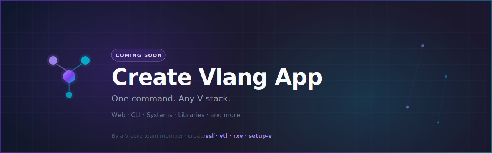

<div align="center">



# Create Vlang App

**One command. Any V stack.**

> The scaffolding toolkit for the [V programming language](https://vlang.io) — by a V core team member, built alongside [Create Node App](https://github.com/Create-Node-App).

[](https://github.com/Create-Vlang-App/create-vlang-app/releases/tag/create-vlang-app%400.1.0)
[](https://vlang.io)
[](https://github.com/Create-Vlang-App/create-vlang-app/blob/main/LICENSE)
[](https://discord.gg/bR5VyATgka)

[CLI](https://github.com/Create-Vlang-App/create-vlang-app) · [Templates](https://github.com/Create-Vlang-App/cva-templates) · [Website](https://create-awesome-vlang-app.vercel.app) · [Release 0.1.0](https://github.com/Create-Vlang-App/create-vlang-app/releases/tag/create-vlang-app%400.1.0)

</div>

---

## What is this?

`Create Vlang App` brings the composition-first scaffolding philosophy of [create-awesome-node-app](https://github.com/Create-Node-App/create-node-app) to the V language ecosystem.

Pick a template. Layer extensions. Bootstrap production-ready V projects without the usual setup overhead.

```bash
curl -fsSL https://create-awesome-vlang-app.vercel.app/install.sh | sh
create-vlang-app my-project --template web-server --addons github-setup
# alias also works: create-awesome-vlang-app my-project --template web-server
```

---

## About the author

This project is maintained by [Ulises Jeremias](https://github.com/ulises-jeremias), a **V language core team member** and author of several foundational libraries in the V ecosystem:

| Project | Description |
|---------|-------------|
| [vlang/vsl](https://github.com/vlang/vsl) | V Scientific Library — linear algebra, stats, optimization |
| [vlang/vtl](https://github.com/vlang/vtl) | V Tensor Library — n-dimensional tensors for V |
| [ulises-jeremias/rxv](https://github.com/ulises-jeremias/rxv) | Reactive Extensions for V |
| [vlang/setup-v](https://github.com/vlang/setup-v) | GitHub Action to set up V in CI workflows |

---

## Available Templates

| Template | Stack | Status |
|----------|-------|--------|
| Web Server | veb | Shipped |
| CLI App | cli + os | Shipped |
| Library Starter | modules, docs, tests | Shipped |
| Systems App | low-level / GC options | Shipped |
| vsl / vtl / rxv starters | scientific & reactive | Shipped |

Catalog: [cva-templates](https://github.com/Create-Vlang-App/cva-templates)

---

## Available Extensions

- **Tooling** — `v fmt`, `v vet`, GitHub Actions with [setup-v](https://github.com/vlang/setup-v)
- **Database** — SQLite, PostgreSQL samples
- **Deployment** — Docker, static binaries
- **Dev environment** — Dev containers

---

## Status

**Shipped** — CLI Release [`create-vlang-app@0.1.0`](https://github.com/Create-Vlang-App/create-vlang-app/releases/tag/create-vlang-app%400.1.0) (linux amd64) and the official template bank are available. VPM and additional OS assets continue to land in follow-up releases.

Docs & catalog:

→ **[create-awesome-vlang-app.vercel.app](https://create-awesome-vlang-app.vercel.app)**

The Node.js counterpart:

→ **[create-awesome-node-app.vercel.app](https://create-awesome-node-app.vercel.app)**

---

## Part of the Create Awesome App ecosystem

| Org | Stack | Status |
|-----|-------|--------|
| [Create-Node-App](https://github.com/Create-Node-App) | Node.js, TypeScript | ✅ Production |
| [Create-Python-App](https://github.com/Create-Python-App) | Python | 🧪 Beta |
| [Create-Vlang-App](https://github.com/Create-Vlang-App) | V language | ✅ Shipped (`0.1.0`) |
